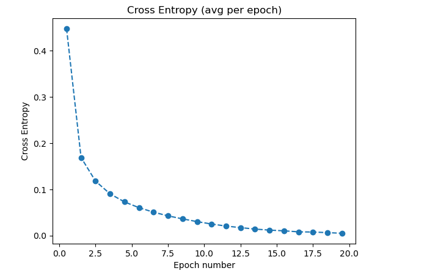
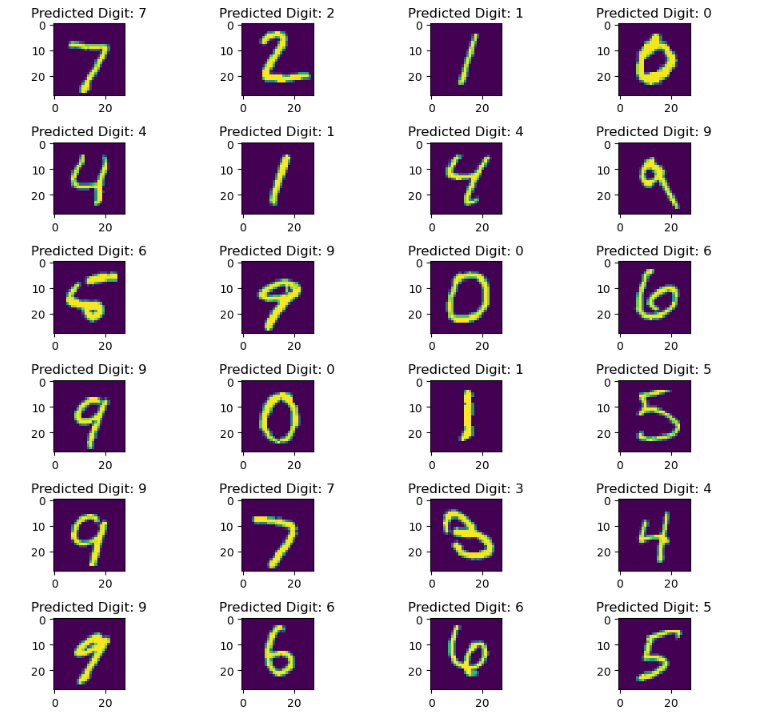

# MNIST-Image-Classifier

This repository contains a notebook for a PyTorch-based neural network model designed to classify images using the MNIST handwritten images dataset.

Data source from Kaggle: [MNIST Dataset on Kaggle](https://www.kaggle.com/datasets/hojjatk/mnist-dataset)

## Neural Network Architecture

### Overview

The network architecture is as follows:

- Input Layer: Flattened 28x28 pixel images.
- Three fully connected (linear) layers with ReLU activation.
- Output Layer: 10 classes for classification.

### Network Details

- **Layer 1 (Input Layer):**
  - Input Size: 784 (28x28 pixels)
  - Output Size: 100
  - Activation Function: ReLU

- **Layer 2:**
  - Input Size: 100
  - Output Size: 50
  - Activation Function: ReLU

- **Layer 3 (Output Layer):**
  - Input Size: 50
  - Output Size: 10 (for classification)

### Forward Pass

The forward pass of this network involves the following steps:

1. Input data is flattened from 28x28 to 784 dimensions.
2. The first linear layer applies a ReLU activation.
3. The second linear layer applies another ReLU activation.
4. The third linear layer (output layer) produces raw scores/logits for classification.

The final output is a 1D tensor, suitable for classification tasks.

### Results & Training

- Training was completed for 20 epochs on a dataset of 60,000 images and a batch size of 5.
- Average loss for each epoch was calculated using cross-entropy loss function.

- Sample testing images are shown below with the model predictions.

